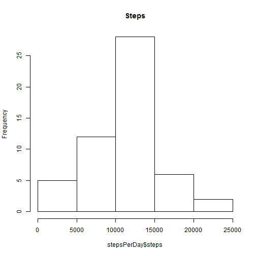
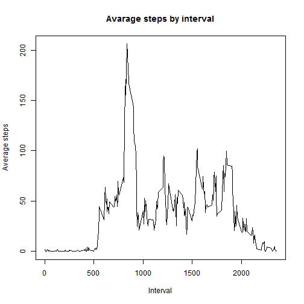
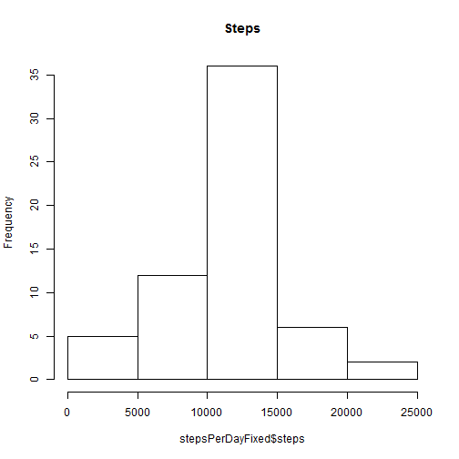
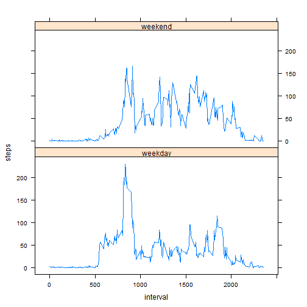

# Reproducible Research: Peer Assessment 1


## Loading and preprocessing the data
* Load the data.

```r
unzip("activity.zip")
```

* Read data and get cleaned datased (with no NA values)

```r
rawdata <- read.csv("activity.csv")
data <- rawdata[complete.cases(rawdata), ]
```


## What is mean total number of steps taken per day?
* Make a histogram of the total number of steps taken each day

```r
library(plyr)
stepsPerDay <- ddply(data, ("date"), summarize, steps = sum(steps))
hist(stepsPerDay$steps, main = "Steps")
```

 


* Calculate and report the mean and median total number of steps taken per day

mean:

```r
mean(stepsPerDay$steps)
```

```
## [1] 10766
```


median:

```r
median(stepsPerDay$steps)
```

```
## [1] 10765
```


## What is the average daily activity pattern?
* Make a time series plot (i.e. type = "l") of the 5-minute interval (x-axis) and the average number of steps taken, averaged across all days (y-axis)

```r
intervalMean <- ddply(data, ("interval"), summarize, steps = mean(steps))
plot(intervalMean$interval, intervalMean$steps, type = "l", xlab = "Interval", 
    ylab = "Average steps", main = "Avarage steps by interval")
```

 


* Which 5-minute interval, on average across all the days in the dataset, contains the maximum number of steps? 


```r
intervalMean[which.max(intervalMean$steps), "interval"]
```

```
## [1] 835
```


## Imputing missing values
* Calculate and report the total number of missing values in the dataset (i.e. the total number of rows with 

```r
sum(is.na(rawdata$steps))
```

```
## [1] 2304
```


* Devise a strategy for filling in all of the missing values in the dataset. The strategy does not need to be sophisticated. For example, you could use the mean/median for that day, or the mean for that 5-minute interval, etc.

The best solution, from my viewpoint, is to fill missing data with mean by `Interval` column. Moreover, we already have mean by interval dataframe.
And let's apply rounding, because seems it's very hard to take fractional number of steps. I tried several times, but all my attempts led to integer steps number.

* Create a new dataset that is equal to the original dataset but with the missing data filled in.


```r
fixedmissing <- merge(rawdata, intervalMean, by = "interval", all = TRUE)
fixedmissing[is.na(fixedmissing$steps.x), "steps.x"] <- round(fixedmissing[is.na(fixedmissing$steps.x), 
    "steps.y"])
```


Because both of the merged data frames had column named `steps` resulting data frame now have columns `step.x` and `step.y`. Let's rename first one back to `steps` and drop second one, because we don't need it anymore.


```r
names(fixedmissing)[names(fixedmissing) == "steps.x"] <- "steps"
fixedmissing$steps.y <- NULL
```

* Make a histogram of the total number of steps taken each day and Calculate and report the mean and median total number of steps taken per day. Do these values differ from the estimates from the first part of the assignment? What is the impact of imputing missing data on the estimates of the total daily number of steps?


```r
stepsPerDayFixed <- ddply(fixedmissing, ("date"), summarize, steps = sum(steps))
hist(stepsPerDayFixed$steps, main = "Steps")
```

 


mean:

```r
mean(stepsPerDayFixed$steps)
```

```
## [1] 10766
```


median:

```r
median(stepsPerDayFixed$steps)
```

```
## [1] 10762
```

Per my understanding, because of insignificant volume of the missing data impact is not very high. Mean is the same, and median changed slightly.


## Are there differences in activity patterns between weekdays and weekends?
* Create a new factor variable in the dataset with two levels – “weekday” and “weekend” indicating whether a given date is a weekday or weekend day.

```r
fixedmissing$date <- as.Date(fixedmissing$date)
fixedmissing$dow <- ifelse(weekdays(fixedmissing$date) %in% c("Sunday", "Saturday"), 
    "weekend", "weekday")
weekSteps <- ddply(fixedmissing, .(interval, dow), summarize, steps = mean(steps))
library(lattice)
```


* Make a panel plot containing a time series plot (i.e. type = "l") of the 5-minute interval (x-axis) and the average number of steps taken, averaged across all weekday days or weekend days (y-axis). The plot should look something like the following, which was creating using simulated data:


```r
xyplot(steps ~ interval | dow, data = weekSteps, layout = c(1, 2), type = "l")
```

 

